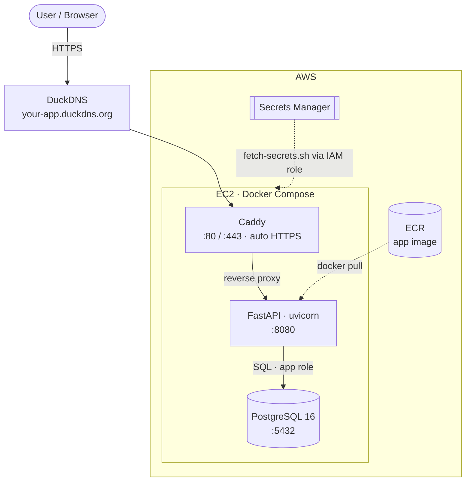
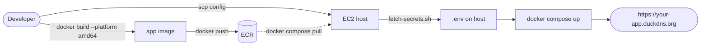
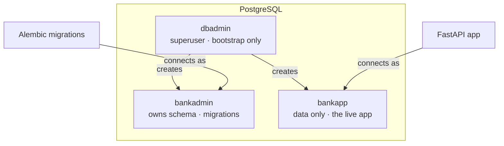

# pythonbank

A containerized banking backend API built with **FastAPI** and **PostgreSQL** (SQLAlchemy ORM + Alembic migrations). Features JWT-based authentication, a 3-tier least-privilege database role model, and a fully containerized deployment on AWS — with Caddy for automatic HTTPS, ECR for the app image, and Secrets Manager for credentials.

## Tech Stack

- **API:** FastAPI (Python), Pydantic / pydantic-settings
- **Database:** PostgreSQL — SQLAlchemy (ORM) + Alembic (migrations)
- **Auth:** JWT (python-jose) + bcrypt password hashing (passlib)
- **Containerization:** Docker + Docker Compose
- **Reverse proxy / TLS:** Caddy (automatic Let's Encrypt HTTPS)
- **Cloud (AWS):** EC2 (host), ECR (image registry), Secrets Manager (credentials), IAM (least-privilege roles)
- **DNS:** DuckDNS

## Architecture

## Deployment Flow

## Database Roles (least privilege)

## Configuration

Secrets are stored in **AWS Secrets Manager** and pulled onto the host at deploy time
by `backend/fetch-secrets.sh` (authorized via the instance's IAM role), which writes a
local `.env` that Docker Compose reads. See `secrets.example.json` for the required keys.

## Status / Roadmap

- [x] Containerized deployment (EC2 + Docker Compose: api + Postgres + Caddy)
- [x] AWS integration (ECR image, Secrets Manager, IAM least-privilege roles)
- [x] Automatic HTTPS via Caddy / Let's Encrypt
- [x] SQLAlchemy models + Pydantic schemas
- [x] Auth helpers (password hashing + JWT)
- [ ] Initial database migration (create tables)
- [ ] Auth endpoints (`/register`, `/login`) + `get_current_user`
- [ ] Resource routers (accounts, transactions, etc.)
- [ ] Frontend (React)
